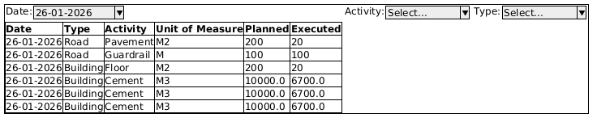

# Takehome Challenge

## Introduction

You're tasked to build a system to generate statistics for activities
planned and executed. Along with this text, you'll receive two files:
one with activities that are planned, and other with activities that
are executed.

## Requirements

The requirements are:

- Users should be able to load CSVs with *planned activities*
- Users should be able to load CSVs with *executed activities*
- It should be possible to match the planned activities with the
  executed ones.
- Users should be able to see these activities filtered by day; that
  is, it should be possible to see what activities were planned and
  executed for a given day, comparing the plan with the actual
  execution.

## Software requirements

- Since we must load and keep track of the activities, we'll need a
  database; your DB **must** be an SQL database, we recommend using
  Postgres.
- Since the user must see the data; there must be some form of
  UI
- There's no need for login or authentication, keep it as simple as
  possible.
- The next phase of the interview will consist of implementing one or
  two features in this same system, so, make your application somewhat
  extensible; no need for super abstract constructs, just make sure
  you can add something new with relative ease.
- If the input files present any form of inconsistency, it's up to you
  to solve them, as long as you report the inconsistency and explain
  your solution.

## UI Sketch

Here's an idea to follow for UI:

We want to see all the aggregated date for the planned and executed
activities, and to be able to filter them by date, activity and type.
